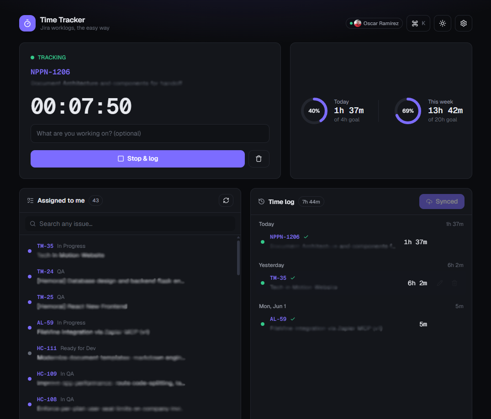
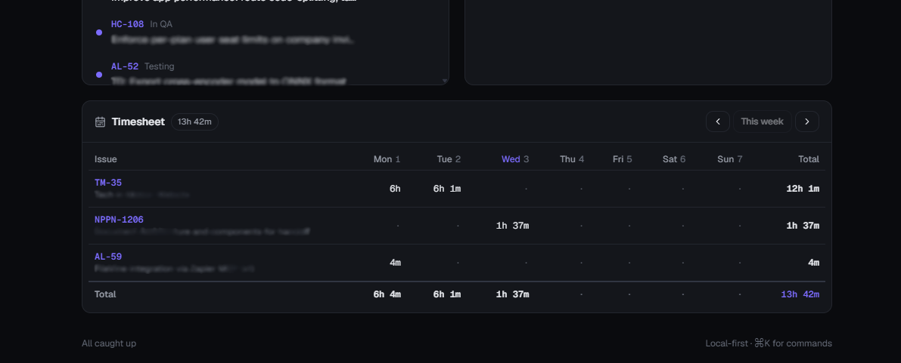

<div align="center">


# Tracktor

**A local-first time tracker for Jira.**
Track your time in a fast, beautiful UI — then sync it to Jira worklogs in one click.
No admin rights, no Marketplace app, just your personal API token.

[](LICENSE)
[](https://nextjs.org)
[](https://react.dev)
[](https://tailwindcss.com)
[](https://web.dev/explore/progressive-web-apps)

[**Deploy your own**](#-deploy-to-vercel) · [Features](#-features) · [How it works](#-how-it-works) · [Quick start](#-quick-start)

</div>

---

## Why Tracktor?

Logging time in Jira is tedious, and most teams either reach for a paid Marketplace app
or forget to track at all. Tracktor is a tiny, self-hostable web app that makes time
tracking pleasant:

- ⏱️ **Start a stopwatch** or log time after the fact with natural durations (`1h30m`, `45m`, `1.5h`, `1d`).
- 🗓️ **Backdate** entries you forgot, edit anything, and see a **weekly timesheet** that reflects what's actually in Jira.
- ☁️ **Local-first** — your time lives in your browser until *you* press **Sync**. Nothing is logged behind your back.
- 🔌 **No admin, no app install.** Uses your personal [Jira API token](https://id.atlassian.com/manage-profile/security/api-tokens) and the standard REST API.
- 🧩 **Works with Clockwork.** Clockwork mirrors native Jira worklogs, so time you sync here appears in Clockwork automatically — no extra setup.

> **Heads-up:** Tracktor is an independent open-source project. It is **not affiliated with,
> endorsed by, or sponsored by Atlassian** (Jira) or **HeroCoders** (Clockwork). "Jira" and
> "Clockwork" are trademarks of their respective owners and are used here only to describe
> compatibility.

## 📸 Screenshots

> _Add your own screenshots to a `docs/` folder and uncomment the lines below._


<p align="center">
  
  
</p>


## ✨ Features

| | |
|---|---|
| **Stopwatch** | One running timer with a live clock, quick-start chips for pinned/recent issues, and the elapsed time shown in the browser tab title. |
| **Manual & backdated logging** | Add time after the fact with a date/time picker and durations like `1h30m`, `45m`, `1.5h`, `1d`. |
| **Edit & delete** | Every entry is editable (duration, comment, issue, date). Changes to already-synced entries **propagate to the Jira worklog** (`PUT`/`DELETE`). |
| **Weekly timesheet** | An issues × days grid that **reads back your existing Jira worklogs** — including time logged via Clockwork or the Jira UI — merged with local pending time. Navigate weeks freely. |
| **Assigned issues + search** | See what's assigned to you, or search **any** issue to log against it. Pin issues for one-click access. |
| **Resilient sync** | Each entry is pushed individually; failures are flagged and a re-sync retries only those. |
| **Goals** | Daily & weekly hour goals with progress rings. |
| **Backup** | Export your log to CSV/JSON and import JSON — move between devices safely. |
| **Command palette** | `⌘K` / `Ctrl+K` to start/stop, sync, jump to an issue, or toggle the theme. |
| **Polish** | Light/dark themes, idle nudge for long-running timers, and **installable as a PWA** on desktop & mobile. |

## 🧠 How it works

```
Browser (local-first state)            Next.js Route Handlers           Jira Cloud
─────────────────────────────         ────────────────────────        ─────────────
stopwatch + pending entries   ──┐      /api/auth      (cookie)
localStorage (zustand)          ├──▶   /api/jira/me
                                │      /api/jira/issues   ──────────▶  REST API v3
press "Sync"  ──────────────────┘      /api/jira/search
                                       /api/jira/worklog(s)
```

- **Server proxy.** Jira Cloud blocks direct browser calls (CORS), so all Jira traffic
  goes through Next.js Route Handlers. Your API token never ships to the client.
- **Local-first.** Your stopwatch and unsynced entries live in `localStorage`. They only
  reach Jira when you click **Sync** — so you can review, edit, and backdate first.
- **Secure credentials.** Entered in the app, your token is stored in a **signed httpOnly
  cookie** (verified against Jira before it's saved) — never readable by page scripts.
  Or skip the UI entirely and provide server **environment variables**.
- **Native worklogs.** Time is written with the standard worklog API
  (`POST /rest/api/3/issue/{key}/worklog`), so it's plain Jira data your team already sees —
  and that Clockwork reads automatically.

## 🚀 Quick start

```bash
git clone https://github.com/OscarRamirezdeArellano/tracktor.git
cd tracktor
npm install
npm run dev          # http://localhost:3000
```

Open the app → click the **gear** → enter your **Jira site URL**, **email**, and
**[API token](https://id.atlassian.com/manage-profile/security/api-tokens)** →
**Connect**. Your assigned issues, stats, and timesheet populate from your real data.

> Requires **Node.js 18+** and a **Jira Cloud** account (`*.atlassian.net`).

## ⚙️ Configuration

Tracktor needs three values. You can provide them **two ways**:

| | In-app Settings | Environment variables |
|---|---|---|
| Best for | Trying it out, shared deploys | A personal deployment |
| Where | Stored in an httpOnly cookie in your browser | `.env.local` / Vercel project env |
| Keys | Site URL, Email, API token | `JIRA_BASE_URL`, `JIRA_EMAIL`, `JIRA_API_TOKEN` |

To use env vars locally, copy the example and fill it in:

```bash
cp .env.example .env.local
```

```env
JIRA_BASE_URL=https://yourcompany.atlassian.net
JIRA_EMAIL=you@example.com
JIRA_API_TOKEN=your-jira-api-token
```

**Creating an API token** (no admin needed): go to
**https://id.atlassian.com/manage-profile/security/api-tokens** → *Create API token* → copy it.

## ▲ Deploy to Vercel

[](https://vercel.com/new/clone?repository-url=https%3A%2F%2Fgithub.com%2FOscarRamirezdeArellano%2Ftracktor&env=JIRA_BASE_URL,JIRA_EMAIL,JIRA_API_TOKEN&envDescription=Optional%20—%20connect%20Jira%20without%20entering%20credentials%20in%20the%20UI)

1. Click the button (or import the repo at [vercel.com/new](https://vercel.com/new)).
2. *(Optional)* set `JIRA_BASE_URL`, `JIRA_EMAIL`, `JIRA_API_TOKEN` to skip the in-app login.
3. Deploy. No other configuration needed — the app lives at the repo root.

You can also deploy from the CLI:

```bash
npx vercel            # preview
npx vercel --prod     # production
```

## ⌨️ Keyboard shortcuts

| Shortcut | Action |
|---|---|
| `⌘K` / `Ctrl+K` | Open the command palette |
| `Enter` | Submit the focused start/log form |
| `↑` `↓` / `Enter` / `Esc` | Navigate, run, or close the palette |

## 🧱 Tech stack

- **[Next.js 16](https://nextjs.org)** (App Router, Route Handlers) · **React 19** · **TypeScript**
- **[Tailwind CSS v4](https://tailwindcss.com)** for styling
- **[Zustand](https://zustand-demo.pmnd.rs/)** for local-first state (with `persist`)
- **[lucide-react](https://lucide.dev)** icons
- Zero database — state is the browser; Jira is the source of truth after sync.

## 📁 Project structure

```
app/
  api/
    auth/route.ts          # cookie-based credential storage (GET/POST/DELETE)
    jira/{me,issues,search,worklog,worklogs}/route.ts
  layout.tsx  page.tsx  globals.css  manifest.ts  icon.svg
components/                # Header, TimerCard, IssueList, EntryList,
                           # TimesheetView, StatsBar, CommandPalette, …
lib/
  store.ts   client.ts   jira-server.ts   format.ts   hooks.ts   exporters.ts   types.ts
public/      icon.svg  sw.js
```

## 🗺️ Roadmap ideas

- Worklog categories / billable flags (Clockwork-style attributes)
- Multiple Jira sites / profiles
- CSV import and richer reports
- Reminders / Slack notifications

Contributions and ideas welcome — see below.

## 🤝 Contributing

PRs and issues are welcome! For larger changes, please open an issue first to discuss.

```bash
npm install
npm run dev
npm run build   # type-check + production build before opening a PR
```

## 🔒 Security

- Your API token is stored in an **httpOnly cookie** (or server env var) and is only ever
  sent server-to-server to Jira. It is never exposed to client JavaScript.
- Found a vulnerability? Please open a private security advisory or email the maintainer
  rather than filing a public issue.

## 📄 License

[MIT](LICENSE) © Oscar Ramírez de Arellano

<div align="center">
<sub>Built because logging time should take seconds, not minutes.</sub>
</div>
